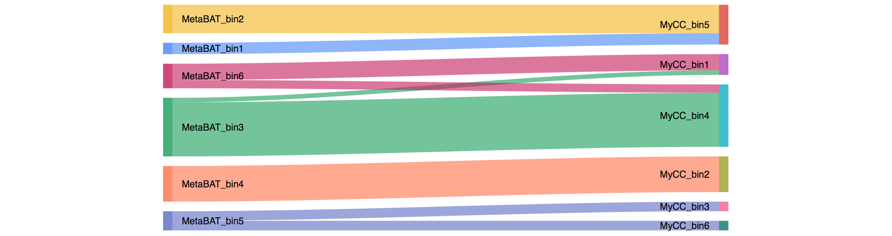

 

Publication
---
+ **Song WZ**, Thomas T (2017) Binning_refiner: Improving genome bins through the combination of different binning programs. Bioinformatics, 33(12), 1873-1875. [PDF](https://songweizhi.github.io/assets/pdfs/Publication_2017_Binning_refiner.pdf)
+ Weizhi Song (songwz03@gmail.com), Torsten Thomas(t.thomas@unsw.edu.au)
+ The Centre for Marine Bio-Innovation (CMB), University of New South Wales, Sydney, Australia

Dependencies:
---
+ [BioPython](https://github.com/biopython/biopython.github.io/)

Change Log:
---
Version 1.4.0 (2019-04-19):
+  Binning_refiner can now supports MORE THAN THREE binning programs.

Version 1.3 (2019-01-06):
+  Binning_refiner can now be installed with "pip install Binning_refiner".

Version 1.2 (2017-11-30):
+  Binning_refiner has been simplified to keep only the core functions, which made it much easier to install and use, hope you enjoy it :)

Important message
---

1.  Binning_refiner can now supports MORE THAN THREE binning programs.

1.  Binning_refiner can now be installed with "pip install Binning_refiner".

1. An independent R version of Binning_refiner is available now [[Binning_refiner.R](https://github.com/songweizhi/Binning_refiner/blob/master/Binning_refiner.R)].
The R packages 
[seqinr](https://cran.r-project.org/web/packages/seqinr/index.html), 
[assertr](https://cran.r-project.org/web/packages/assertr/index.html), 
[tidyr](https://cran.r-project.org/web/packages/tidyr/index.html), 
[tools](https://www.rdocumentation.org/packages/tools/versions/3.5.3), 
[optparse](https://cran.r-project.org/web/packages/optparse/index.html), 
[googleVis](https://cran.r-project.org/web/packages/googleVis/index.html)
are required for running Binning_refiner.R.

1.  In the original version of Binning_refiner, the blast approach (as described in its [publication](http://dx.doi.org/10.1093/bioinformatics/btx086))
was used to identify the same contig among input bin sets. As Binning_refiner was designed to refine bins derived from the same set of assemblies
and the blast step is time-consuming (especially for big dataset), the same assembly among different bin sets was identified by its ID rather than
blastn, which made Binning_refiner much faster to run and more easier to install.

How to install:
---

+ Binning_refiner can be installed with pip now:
        
        # For installation
        pip install Binning_refiner
        
        # For update
        pip install --upgrade Binning_refiner

+ Visualisation of the correlations between input bins (figure below) can be enabled with '-plot' option.
The R packages [optparse](https://cran.r-project.org/web/packages/optparse/index.html) and [googleVis](https://cran.r-project.org/web/packages/googleVis/index.html) are needed for this function.

Help information:
---
        Binning_refiner -h
          
          -i          input bin folder
          -p          output prefix
          -m          minimal size (Kbp) of refined bin, default: 512
          -plot       visualize refinement with Sankey plot
          -x          the width of sankey plot
          -y          the height of sankey plot
          -q          silent progress report

How to run:
---

1. The input for Binning_refiner v1.4 is a folder hold all input bins derived from the same set of assemblies, 
with each binning program produced bins stored in a separated sub-folder.
Here is an example of the [input_bin_folder](https://github.com/songweizhi/Binning_refiner/tree/master/examples). 

1. All bin files in the same sub-folder must have the same extension.

1. Binning_refiner now compatible with both python2 and python3.

        # example command
        Binning_refiner -i input_bin_folder -p Human -plot
        
        # For R version Binning_refiner
        Rscript path/to/Binning_refiner.R -i input_bin_folder -p Human
        

Output files:
---
1. All refined bins larger than defined bin size cutoff.

1. The id of the contigs in each refined bin.

1. The size of refined bins and where its contigs come from.

1. Visualisation of binning refinement.

    

