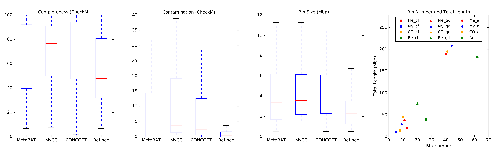

Binning_refiner
---

+ Binning_refiner: Improving genome bins through the combination of different binning programs (https://doi.org/10.1093/bioinformatics/btx086)
+ Version: 1.1
+ Last update: 2017-01-08
+ Contact: Weizhi Song (songwz03@gmail.com), Torsten Thomas(t.thomas@unsw.edu.au)
+ Affiliation: The Centre for Marine Bio-Innovation (CMB), The University of New South Wales, Sydney, Australia

Dependencies:
---

+ [R](https://www.r-project.org)
+ R package: [GoogleVis](https://github.com/mages/googleVis#googlevis)
+ Python module: [rpy2](http://rpy2.bitbucket.org)
+ Python module: [Numpy](http://www.numpy.org)
+ Python module: [Matplotlib](http://matplotlib.org)
+ Python module: [BioPython](https://github.com/biopython/biopython.github.io/)
+ [CheckM](http://ecogenomics.github.io/CheckM/)

Change Log:
---
Version 1.1 (2017-01-08):
+ add support for 3 binning programs.
+ no need to run blast, greatly reduced process time.
+ "root" bins given by CheckM are not included in the output plot.
+ users are able to customize the completeness cutoff for contamination-free bins now.
+ add data for good-quality bins.
+ users are able to customize the completeness and contamination cutoff for good-quality bins.
+ export customized good-quality bins to a separated folder

Version 1.0 (2016-11-11):
+ None

How to install:
---
        # Binning_refiner has been tested on Mac and Linux system.

        # Install the latest python (version 3) on your system (https://www.python.org).

        # Download Binning_refiner and unzip it.
        unzip Binning_refiner.zip

        # cd to the unzipped folder and install with setup.py
        cd Binning_refiner
        python setup.py install

        # install R and R package googleVis

How to run:
---

1. Binning_refiner takes two or three binning programs produced bin sets as inputs. You need to define a working directory to
hold all input and output files. Input bin sets from different binning programs need to be placed in different folders
directly under working directory.

1. Accepted bin file extensions include 'fa', 'fas' or 'fasta'. All input bins in the same folder must have the same extension.

1. Binning_refiner scripts are implemented in python3, please use python3 instead of python.

1. Blast step was removed from version 1.1, Binning_refiner is now using contig id to get the shared contigs between
different bins. which means all input bins for Binning_refiner must be derived from the same set of contigs.

1. For Katana users from UNSW, a specialized manual was prepared and placed at folder "manual".

        # Example commands:

        # 1. get refined bins
        Binning_refiner -1 MetaBAT -2 MyCC
        # or
        Binning_refiner -1 MetaBAT -2 MyCC -3 Concoct

        # 2. get qualities
        CheckM_runner -1 MetaBAT -2 MyCC -r outputs/Refined -qsub
        # or
        CheckM_runner -1 MetaBAT -2 MyCC -3 Concoct -r outputs/Refined -qsub

        # 3. get statistics
        Get_statistics -1 MetaBAT -2 MyCC -r outputs/Refined
        # or
        Get_statistics -1 MetaBAT -2 MyCC -3 Concoct -r outputs/Refined

        # For more information:
        Binning_refiner -h
        CheckM_runner -h
        Get_statistics -h

Output files:
---

1. All refined bins larger than defined size cutoff and their qualities.

1. Refined contamination-free bins (you can customize the completeness cutoff for contamination-free bins from Get_statistics.py).

1. Refined good-quality bins (you can customize the completeness and contamination cutoff for good-quality bins from Get_statistics.py).

1. Cross-link (shared sequences) between input bins. Each band will be treated as a refined bin, the width is proportional to its size. We will get 9 refined bins in the illustration.

    

1. Statistics of input and refined bins.

    
