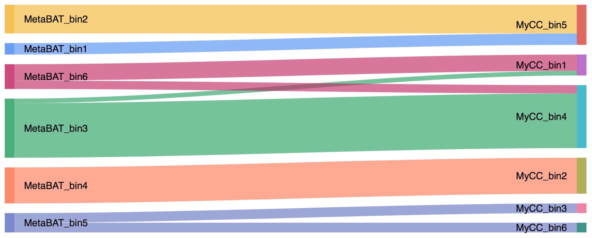

Publication
---
+ Song WZ, Thomas T (2017) Binning_refiner: Improving genome bins through the combination of different binning programs. Bioinformatics, 33(12), 1873-1875. http://dx.doi.org/10.1093/bioinformatics/btx086
+ Contact: Weizhi Song (songwz03@gmail.com), Torsten Thomas(t.thomas@unsw.edu.au)
+ Affiliation: The Centre for Marine Bio-Innovation (CMB), The University of New South Wales, Sydney, Australia

Dependencies:
---
+ [BioPython](https://github.com/biopython/biopython.github.io/)

Change Log:
---
Version 1.2 (2017-11-30):
+  Binning_refiner has been simplified to keep only the core functions, which made it much easier to install and use, hope you enjoy it :)

How to install:
---
The only thing you need to do is to install the latest version of Python and Biopython.

How to run:
---
1. Binning_refiner takes two or three binning programs produced bin sets as inputs. You need to define a working directory to
hold all input and output files. Input bin sets from different binning programs need to be placed in different folders
directly under working directory.

1. Accepted bin file extensions include 'fa', 'fas' or 'fasta'. All input bins in the same folder must have the same extension.

1. Binning_refiner now compatible with both python2 and python3.

        # For two binning programs (e.g. MetaBAT and MyCC)
        python Binning_refiner.py -1 MetaBAT -2 MyCC

        # For two binning programs (e.g. MetaBAT, MyCC and CONCOCT)
        python Binning_refiner.py -1 MetaBAT -2 MyCC -3 CONCOCT

1. You may want to run get_sankey_plot.R to visualize the correlations between your input bin sets. To run this R script,
you need to have R and the following three packages installed: [tools](https://www.rdocumentation.org/packages/tools),
[optparse](https://cran.r-project.org/web/packages/optparse/index.html), [googleVis](https://cran.r-project.org/web/packages/googleVis/index.html).

        # Example command
        Rscript get_sankey_plot.R -f GoogleVis_Sankey_0.5Mbp.csv -x 800 -y 1000

    

Output files:
---
1. All refined bins larger than defined bin size cutoff.
1. The id of the contigs in the refined bins.
1. The size of refined bins and where its contigs come from.
