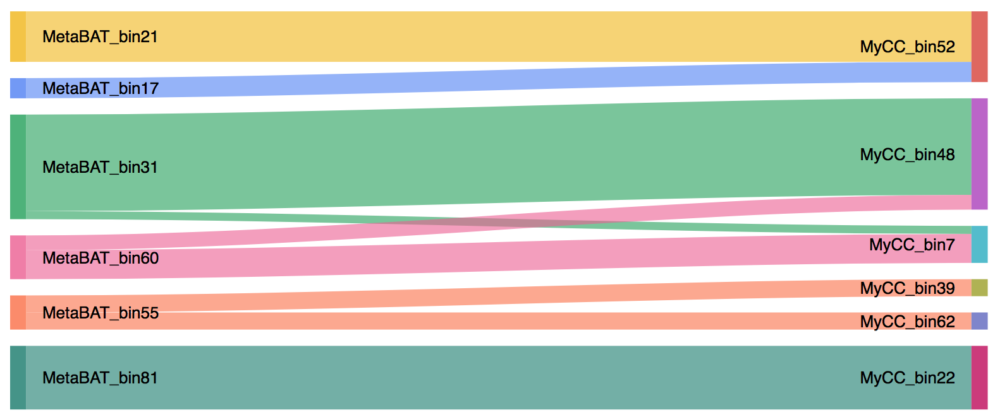

Binning Refiner
---

+ This pipeline was developed to refine metagenomics bins by the combination of different binning programs.

+ Contact: songwz03@gmail.com

Dependencies:
---

+ [R](https://www.r-project.org)
+ [Numpy](http://www.numpy.org)
+ [Matplotlib](http://matplotlib.org)
+ [rpy2](http://rpy2.bitbucket.org)
+ [GoogleVis](https://github.com/mages/googleVis#googlevis)
+ [CheckM](http://ecogenomics.github.io/CheckM/)
+ [BioPython](https://github.com/biopython/biopython.github.io/)
+ [Blast+ 2.2.31](http://www.ncbi.nlm.nih.gov/news/06-16-2015-blast-plus-update/)

How to run it:
---

1. It is recommended to define a working directory to hold all input and output files. Input bin sets from different
binning programs need to be placed in different folders directly under working directory.

1. Accepted bin file extensions include 'fa', 'fas' or 'fasta'. All input bins in the same folder must have the same extension.

1. (Reminder) As CheckM is a memory eating program, CheckM_qsuber.py will submit one job for each input/output bins. This will become annoying
if you have hundreds of bins, as the same number of emails will influx your email account!

        # Binning Refiner scripts are implemented in python3, please use python3 instead of python, path to python3 executable on Katana is:
        /share/apps/python/3.4.3/bin/python3

        # Modules need to be loaded:
        $ module load R/3.2.2
        $ module load blast+/2.2.31

        # Example commands:
        $ /path/to/python3 /path/to/Binning_refiner.py -wd /path/to/working/directory -f first_input_bin_folder_name -s second_input_bin_folder_name
        $ /path/to/python3 /path/to/CheckM_qsuber.py -email your_email_address -i /path/to/bin/folder
        $ /path/to/python3 /path/to/Get_statistics.py -f /path/to/first/bin/folder -s /path/to/second/bin/folder -r /path/to/refined/bin/folder -o /path/to/output/folder

        # For help:
        $ /path/to/python3 /path/to/Binning_refiner.py -h
        $ /path/to/python3 /path/to/CheckM_qsuber.py -h
        $ /path/to/python3 /path/to/Get_statistics.py -h

Output files:
---

1. Refined bins (from Binning_refiner.py)

1. Contamination-free refined bins (from Get_statistics.py)

1. Cross-link (shared sequences) between input bins (from Binning_refiner.py)

    

    Each band in the above image represents one refined bin, we will get 9 refined bins in this case:

        MetaBAT_bin2___MyCC_bin5.fasta   MetaBAT_bin1___MyCC_bin5.fasta   MetaBAT_bin6___MyCC_bin1.fasta
        MetaBAT_bin6___MyCC_bin4.fasta   MetaBAT_bin3___MyCC_bin1.fasta   MetaBAT_bin3___MyCC_bin4.fasta
        MetaBAT_bin4___MyCC_bin2.fasta   MetaBAT_bin5___MyCC_bin3.fasta   MetaBAT_bin5___MyCC_bin6.fasta

1. Statistics of input and refined bins (from Get_statistics.py)

    
